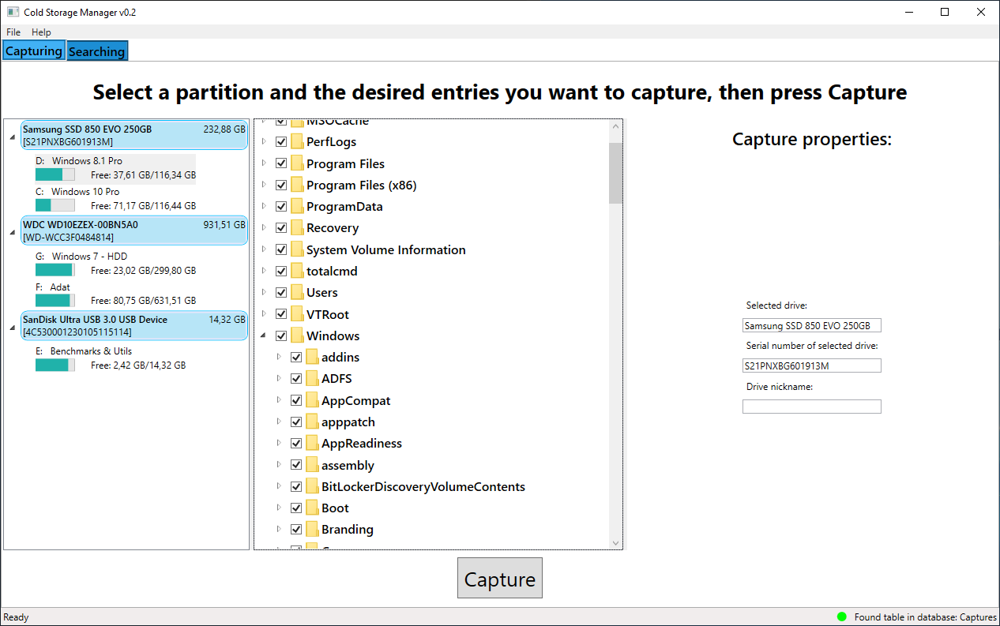

# ColdStorageManager
------

A Windows desktop app that can save the files (or at least their names with some metadata)
stored on a selected partition, and later search in them -- without that drive having to be connected at all.
If you have a lot of offline storage drives (e.g. for backups), this can be a nice way to quickly find a
file you're looking for.

